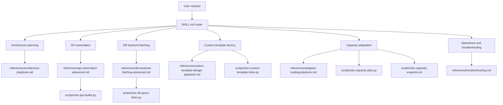
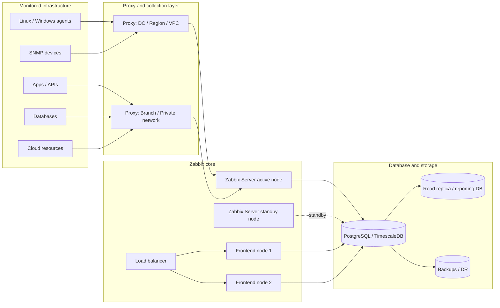

<div align="center">

# zabbix-expert

### Master Zabbix Skill Plugin for Claude Code and OpenAI Codex

Design, scale, troubleshoot, automate, and extend Zabbix from small single-server setups to large distributed HA monitoring platforms.

<br>


<br>

<table>
<tr><td><b>Architecture</b></td><td>Small, medium, large, HA, proxy-based, multi-region, and DR-ready Zabbix designs.</td></tr>
<tr><td><b>Automation</b></td><td>Safe API workflows, bulk onboarding, import comparison, dry-run planning, and desired-state operations.</td></tr>
<tr><td><b>Database</b></td><td>Smart read-only backend fetching for PostgreSQL, TimescaleDB, MySQL, and MariaDB.</td></tr>
<tr><td><b>Templates</b></td><td>100% custom Zabbix template factory using native Zabbix features first.</td></tr>
<tr><td><b>Capacity</b></td><td>Adaptive scaling plans for high I/O, queues, cache pressure, proxy backlog, and NVPS growth.</td></tr>
</table>

</div>

---

## What is this?

`zabbix-expert` is a production-focused Agent Skill plugin for **Claude Code** and **OpenAI Codex**. It gives coding agents a structured Zabbix operations brain: architecture rules, API automation patterns, database query guardrails, custom template design rules, scaling playbooks, safe scripts, and reference documents.

It is built for real teams managing Zabbix across single-node labs, medium production deployments, thousands of hosts, multiple proxies, PostgreSQL/TimescaleDB, MySQL/MariaDB, distributed data centers, cloud/private networks, high-I/O monitoring workloads, and custom dashboards.

---

## Installation

Claude Code supports this repository in three useful modes:

1. **Marketplace plugin** for shareable/team installation.
2. **Local plugin** for testing with `--plugin-dir`.
3. **Plain skill** for short project-local `/zabbix-expert` usage.

This repository includes:

| File | Purpose |
|---|---|
| [`.claude-plugin/plugin.json`](./.claude-plugin/plugin.json) | Claude Code plugin manifest. Gives the plugin its name, version, description, author, license, and metadata. |
| [`.claude-plugin/marketplace.json`](./.claude-plugin/marketplace.json) | Marketplace catalog so Claude Code can install this repo as a plugin marketplace. |
| [`SKILL.md`](./SKILL.md) | Main single-skill entrypoint. |
| [`AGENTS.md`](./AGENTS.md) | Codex/agent operating rules. |

### Option 1: Install from this GitHub repo as a Claude Code marketplace plugin

Run inside Claude Code:

```text
/plugin marketplace add rushikeshsakharleofficial/zabbix-expert
/plugin install zabbix-expert@zabbix-expert-marketplace
/reload-plugins
```

Plugin skills are namespaced by the plugin name:

```text
/zabbix-expert:zabbix-expert design a large Zabbix architecture for 2000 hosts with PostgreSQL, TimescaleDB, proxies, and HA
```

### Option 2: Test locally with `--plugin-dir`

Use this while developing or validating the plugin before marketplace installation.

```bash
git clone https://github.com/rushikeshsakharleofficial/zabbix-expert.git
cd zabbix-expert
claude --plugin-dir .
```

Then run inside Claude Code:

```text
/zabbix-expert:zabbix-expert create a smooth expansion plan for high I/O and queue delay
```

### Option 3: Install as a personal skills-directory plugin

Claude Code can load a plugin folder from the personal skills directory when the folder contains `.claude-plugin/plugin.json`.

```bash
mkdir -p ~/.claude/skills
git clone https://github.com/rushikeshsakharleofficial/zabbix-expert.git ~/.claude/skills/zabbix-expert
```

Then restart Claude Code or run:

```text
/reload-plugins
```

### Option 4: Use as a plain project skill without plugin namespace

Use this when you want the shorter direct skill command inside one project.

```bash
mkdir -p .claude/skills/zabbix-expert
cp -a SKILL.md AGENTS.md agents references assets scripts .claude/skills/zabbix-expert/
```

Then invoke it as:

```text
/zabbix-expert design a custom Zabbix template for an HTTP API service
```

### Claude Code version check

If `/plugin` is not recognized, update Claude Code first:

```bash
claude --version
npm install -g @anthropic-ai/claude-code@latest
# or, if installed with Homebrew:
brew upgrade claude-code
```

---

## Main capabilities

| Area | What the skill does | Key files |
|---|---|---|
| Core Zabbix architecture | Designs small, medium, large, HA, proxy, and multi-region architectures | [`SKILL.md`](./SKILL.md), [`references/architecture-playbook.md`](./references/architecture-playbook.md) |
| API automation | Creates safe JSON-RPC workflows with dry-run-first behavior | [`agents/zabbix-api-automation.md`](./agents/zabbix-api-automation.md), [`references/api-automation-advanced.md`](./references/api-automation-advanced.md) |
| DB architecture | Generates read-only, optimized SQL for backend panels and reports | [`agents/zabbix-db-architecture.md`](./agents/zabbix-db-architecture.md), [`references/db-backend-fetching-advanced.md`](./references/db-backend-fetching-advanced.md) |
| Custom templates | Designs original Zabbix templates using native modules first | [`agents/zabbix-custom-template-factory.md`](./agents/zabbix-custom-template-factory.md), [`references/custom-template-design-playbook.md`](./references/custom-template-design-playbook.md) |
| Capacity adaptation | Plans smooth scaling when queue, I/O, NVPS, DB, or proxy pressure appears | [`agents/zabbix-capacity-adaptation.md`](./agents/zabbix-capacity-adaptation.md), [`references/adaptive-scaling-playbook.md`](./references/adaptive-scaling-playbook.md) |
| Troubleshooting | Uses read-only diagnostics before changes | [`references/troubleshooting.md`](./references/troubleshooting.md), [`scripts/zbx-readonly-healthcheck.sh`](./scripts/zbx-readonly-healthcheck.sh) |
| Security | Enforces PSK/TLS/RBAC/secrets-safe behavior | [`references/security-hardening.md`](./references/security-hardening.md) |

---

## Architecture overview



---

## Zabbix deployment model supported by the skill



---

## Folder structure

```text
zabbix-expert/
├── .claude-plugin/
│   ├── plugin.json
│   └── marketplace.json
├── SKILL.md
├── AGENTS.md
├── README.md
├── LICENSE
├── agents/
├── references/
├── assets/
└── scripts/
```

### Root files

| File | Purpose |
|---|---|
| [`.claude-plugin/plugin.json`](./.claude-plugin/plugin.json) | Claude Code plugin manifest. |
| [`.claude-plugin/marketplace.json`](./.claude-plugin/marketplace.json) | Claude Code marketplace catalog. |
| [`SKILL.md`](./SKILL.md) | Main skill definition and router used by Claude Code / Codex. |
| [`AGENTS.md`](./AGENTS.md) | Codex project instructions and operational guardrails. |
| [`README.md`](./README.md) | Project documentation. |
| [`LICENSE`](./LICENSE) | MIT license for public use. |

### `agents/`

| File | Purpose |
|---|---|
| [`zabbix-api-automation.md`](./agents/zabbix-api-automation.md) | API automation agent for JSON-RPC, host onboarding, maintenance, and safe writes. |
| [`zabbix-db-architecture.md`](./agents/zabbix-db-architecture.md) | DB architecture agent for MySQL, MariaDB, PostgreSQL, and TimescaleDB read patterns. |
| [`zabbix-custom-template-factory.md`](./agents/zabbix-custom-template-factory.md) | 100% custom template factory using native Zabbix modules first. |
| [`zabbix-capacity-adaptation.md`](./agents/zabbix-capacity-adaptation.md) | Scaling/adaptation agent for high I/O, queue delay, NVPS growth, and expansion planning. |

### `references/`

| Category | Files |
|---|---|
| Architecture | [`architecture-playbook.md`](./references/architecture-playbook.md), [`sizing-and-capacity.md`](./references/sizing-and-capacity.md) |
| Capacity adaptation | [`adaptive-scaling-playbook.md`](./references/adaptive-scaling-playbook.md), [`high-io-diagnosis.md`](./references/high-io-diagnosis.md), [`capacity-expansion-decision-tree.md`](./references/capacity-expansion-decision-tree.md), [`scale-out-migration-phases.md`](./references/scale-out-migration-phases.md) |
| API automation | [`api-automation.md`](./references/api-automation.md), [`api-automation-advanced.md`](./references/api-automation-advanced.md) |
| Database | [`db-backend-fetching-advanced.md`](./references/db-backend-fetching-advanced.md), [`db-schema-query-map.md`](./references/db-schema-query-map.md) |
| Template factory | [`custom-template-design-playbook.md`](./references/custom-template-design-playbook.md), [`native-module-decision-tree.md`](./references/native-module-decision-tree.md), [`custom-lld-design-patterns.md`](./references/custom-lld-design-patterns.md), [`custom-dependent-item-patterns.md`](./references/custom-dependent-item-patterns.md), [`custom-preprocessing-patterns.md`](./references/custom-preprocessing-patterns.md), [`custom-trigger-design-patterns.md`](./references/custom-trigger-design-patterns.md), [`macro-tag-value-map-strategy.md`](./references/macro-tag-value-map-strategy.md), [`no-shell-first-policy.md`](./references/no-shell-first-policy.md), [`template-production-review-checklist.md`](./references/template-production-review-checklist.md) |
| Operations | [`operations-runbooks.md`](./references/operations-runbooks.md), [`troubleshooting.md`](./references/troubleshooting.md), [`security-hardening.md`](./references/security-hardening.md), [`upgrade-migration.md`](./references/upgrade-migration.md), [`monitoring-coverage.md`](./references/monitoring-coverage.md) |

### `assets/`

| Folder | Purpose |
|---|---|
| [`assets/api/`](./assets/api/) | API payload examples and bulk host onboarding samples. |
| [`assets/db/`](./assets/db/) | PostgreSQL/MySQL smart query examples. |
| [`assets/custom-template/`](./assets/custom-template/) | Custom template blueprints and import rules. |
| [`assets/adaptation/`](./assets/adaptation/) | Capacity input form, high-I/O triage checklist, and adaptation report template. |

### `scripts/`

| Script | Purpose |
|---|---|
| [`zbx-readonly-healthcheck.sh`](./scripts/zbx-readonly-healthcheck.sh) | Safe read-only host/service/log diagnostics. |
| [`zbx-capacity-snapshot.sh`](./scripts/zbx-capacity-snapshot.sh) | Read-only high-I/O and capacity snapshot helper. |
| [`zbx-capacity-plan.py`](./scripts/zbx-capacity-plan.py) | Generates a phased scaling recommendation from JSON metrics. |
| [`zbx-api-smoke.py`](./scripts/zbx-api-smoke.py) | Tests Zabbix API availability using `ZBX_URL` and `ZBX_TOKEN`. |
| [`zbx-api-toolkit.py`](./scripts/zbx-api-toolkit.py) | Dry-run-first API automation helper. |
| [`zbx-db-query-linter.py`](./scripts/zbx-db-query-linter.py) | SQL safety and scalability linter. |
| [`zbx-custom-template-linter.py`](./scripts/zbx-custom-template-linter.py) | Custom Zabbix template design linter. |
| [`zbx-postgres-sql-health.sql`](./scripts/zbx-postgres-sql-health.sql) | PostgreSQL health checks for Zabbix DB review. |
| [`zbx-proxy-log-summary.sh`](./scripts/zbx-proxy-log-summary.sh) | Proxy log pressure/error summary. |

---

## Safety model


Rules enforced by the skill:

- read-only diagnostics first
- no secret exposure
- no destructive SQL by default
- no direct DB writes for custom dashboards/reports
- no shell-first template design
- no TimescaleDB recommendation for Zabbix proxy DB
- no claim that Zabbix server HA is active/active throughput scaling
- every production change must include validation and rollback

---

## Quick examples

### Capacity adaptation

```bash
cat > snapshot.json <<'JSON'
{
  "hosts": 2000,
  "enabled_items": 200000,
  "current_nvps": 3500,
  "projected_nvps": 7000,
  "queue_delayed": 1200,
  "preprocessing_queue": 200,
  "history_cache_used_pct": 82,
  "value_cache_used_pct": 76,
  "db_iowait_pct": 12,
  "db_disk_await_ms": 25,
  "poller_busy_pct": 88,
  "history_syncer_busy_pct": 91,
  "frontend_slow": false,
  "proxy_backlog": true
}
JSON

python3 scripts/zbx-capacity-plan.py snapshot.json
```

### API smoke test

```bash
export ZBX_URL="https://zabbix.example.com/api_jsonrpc.php"
export ZBX_TOKEN="REDACTED"
python3 scripts/zbx-api-smoke.py
```

### DB query linter

```bash
python3 scripts/zbx-db-query-linter.py assets/db/postgresql/smart_queries.sql assets/db/mysql/smart_queries.sql
```

### Custom template linter

```bash
python3 scripts/zbx-custom-template-linter.py assets/custom-template/*.yaml
```

---

## Star history

<div align="center">

[](https://star-history.com/#rushikeshsakharleofficial/zabbix-expert&Date)

</div>

---

## License

This project is released under the [MIT License](./LICENSE). Anyone can use, modify, distribute, and build on it.

---

## Author

Created and maintained by [Rushikesh Sakharle](https://github.com/rushikeshsakharleofficial).
